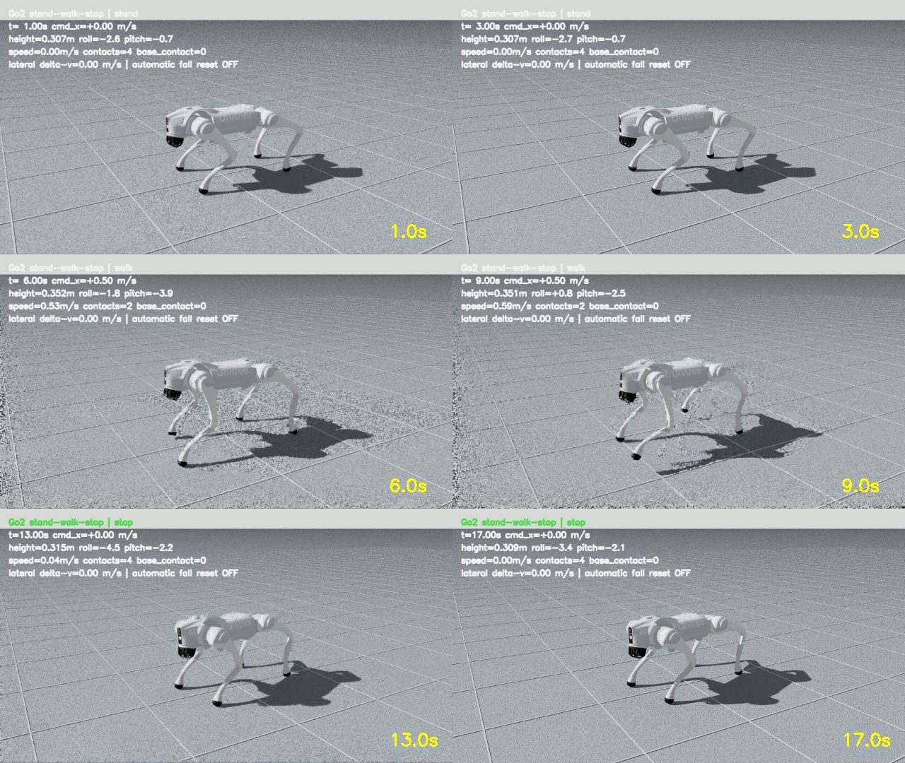
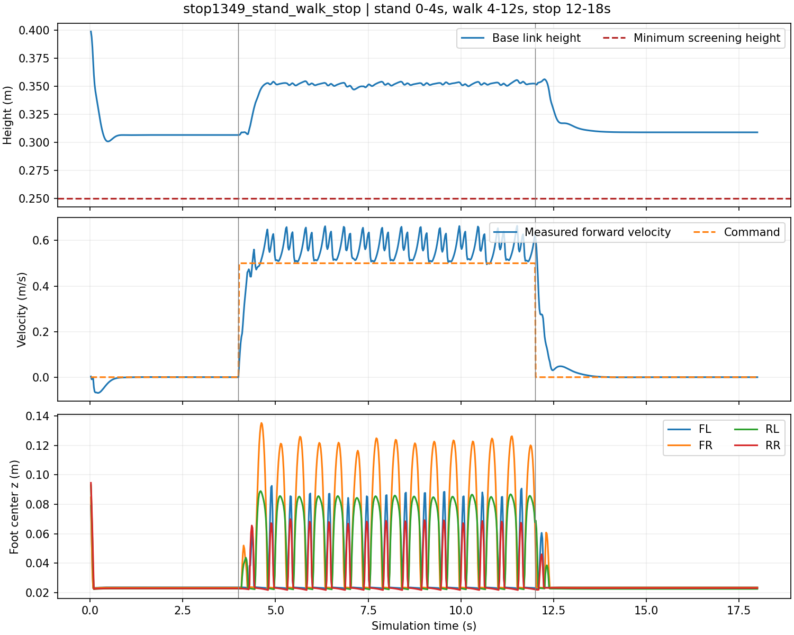

# Go2 · Standing, Locomotion & Recovery

> milet-vidon 的四足机器人强化学习作品集：从失败姿态诊断，到可复核的站立、行走与停止。

[](https://isaac-sim.github.io/IsaacLab/)
[](https://www.unitree.com/go2)
[](docs/stance-and-gait-20260909.md)
[](LICENSE)

**当前成果：平地静止支撑、0.5 m/s 指令下对角步态行走、停止后回到四足站立。** 推荐模型 Natural Stop 1349 在三组随机种子下通过固定测试，并通过一组三次横向速度冲击测试。此前候选 Natural 950 的结果也完整保留。仍有轻微倾斜、足端轨迹不对称和速度偏差；没有完成参考视频全部行为、AMP 复现或实机验证。



## 演示与测量

| 场景 | 完整视频 | 原始报告 |
| --- | --- | --- |
| Natural Stop 1349：站立 4 s → 行走 8 s → 停止 6 s | [观看视频](videos/stop1349_stand_walk_stop.mp4) | [JSON](evaluations/natural-20260909/stop1349_video.json) · [逐帧 CSV](evaluations/natural-20260909/stop1349_video.csv) |
| Natural Stop 1349：三阶段横向冲击 | [观看视频](videos/stop1349_lateral_impulses.mp4) | [JSON](evaluations/natural-20260909/stop1349_push.json) |
| 此前 Natural 950：站走停对照 | [观看视频](videos/natural950_stand_walk_stop.mp4) | [JSON](evaluations/natural-20260909/natural950_seed09.json) |

视频保留起步、停止和受扰过程，关闭跌倒自动重置。冲击是在 2、8、15 秒施加 +0.5、−0.5、+0.5 m/s 的横向速度增量，并非已标定的物理推力。

| Natural Stop 1349 三次无扰测试范围 | 测量结果 |
| --- | --- |
| 静止 / 行走 / 停止平均机身高度 | 0.307–0.316 / 0.352–0.366 / 0.309–0.321 m |
| 0.5 m/s 指令的实测平均前进速度 | 0.549–0.572 m/s |
| 停止速度 P95 | 0.006–0.021 m/s |
| 停止后进入连续 1 s 稳定四足支撑 | 0.52–0.70 s |
| 稳态站立及停止的四足接触比例 | 100% |
| 机身接地 / 自动重置 | 0 / 0 |

统计排除各阶段前 1 秒，视频保留全程。种子为 20260909、20260910、20260911，变化来自初始质量/摩擦随机化；起始位姿固定为正常朝上。三次测试不代表任意环境下的成功率。[协议、失败分析与论文笔记](docs/stance-and-gait-20260909.md)。



## 方法与个人工作

基于 NVIDIA Isaac Lab、Isaac Sim 5.1 与 RSL-RL PPO。Go2 使用 48 维观测、12 维关节位置动作，控制频率 50 Hz，物理频率 200 Hz，PD 参数 25 / 0.5。

- 审计 USD 资产、接地平面和关节姿态，纠正先前错误的高度解释。
- 将 Isaac Lab Spot 的摆动时长、对角同步、滑移及关节姿态奖励适配至 Go2，加入零指令训练。
- 建立连续站走停测试，记录足端接触和真实运动，识别“站起来但拖脚”和“训练更久却不停步”的失败模式。
- 保存训练参数、模型哈希、完整视频、原始 CSV 和失败报告，按验证表现选择 checkpoint。

这是**显式步态奖励 PPO**。Escontrela 等人的 AMP 工作及参考视频对应的 Wu 等人论文用于方法研究；本仓库尚未实现动作判别器和犬类动作重定向，不能称为 AMP 复现。[引用与直接使用的上游代码](docs/stance-and-gait-20260909.md#literature-checked)。

## 快速复测（Windows / E 盘）

已验证环境：RTX 4060 Laptop 8 GB，Isaac Sim 5.1，Isaac Lab 源码版本 `37ddf626871758333d6ed89cf64ad702aef127d0`。先安装 Isaac Lab：Python 环境位于 `E:\IsaacLab\env`，源码位于 `E:\IsaacLab\repo`。本仓库放在 `E:\IsaacLab\go2-rl-open-source`。本项目是任务覆盖层，不包含模拟器或机器人 USD 资产。

```powershell
# 安装任务和评估脚本；旧文件先备份到 E 盘
& E:\IsaacLab\go2-rl-open-source\scripts\install.ps1

# 连续站走停测试：输出 JSON、CSV、MP4
& E:\IsaacLab\go2-rl-open-source\scripts\evaluate_stand_walk_stop.ps1 `
  -Task Isaac-Natural-Stop-Flat-Unitree-Go2-Play-v0 `
  -Checkpoint E:\IsaacLab\go2-rl-open-source\models\locomotion\natural_stop_model1349.pt `
  -OutputDir E:\IsaacLab\evaluations\my-go2-test
```

在评估命令后加 `-PushSpeed 0.5` 即可加入横向冲击，建议改用另一个输出目录。GUI 单独观察可运行 `scripts/play.ps1 -Stage natural_stop -Static` 或 `-ForwardCommand`，并传入上述完整 checkpoint 路径。正式验收使用固定评估脚本，避免随机命令与自动重置影响判断。

脚本将临时文件、Isaac Sim 用户数据及 pip 缓存指向 E 盘。可选资产路径为 `E:\IsaacLab\userdata\assets\Robots\Unitree\Go2\go2.usd` 和 `Environments\Grid\default_environment.usd`；安装脚本加入缓存路径支持，缺少缓存时使用 NVIDIA 官方资源地址。

## 训练与模型选择

```powershell
& E:\IsaacLab\go2-rl-open-source\scripts\train.ps1 `
  -Stage natural -NumEnvs 512 -MaxIterations 1000 -Headless
```

上面从头训练，**不等于复现发布权重的训练历程**。Natural 950 从 calibrated standard 598 微调，后者从官方 flat Go2 checkpoint 初始化。来源见 [manifest](configs/experiment_manifest.json) 和 [训练配置](configs/natural-20260909/)。完整 Natural 训练新增 12,288,000 环境步；最终 1597 权重出现零指令继续行走，拒绝作为推荐模型，保留其[失败记录](evaluations/natural-20260909/natural1597_failed_stop.json)。

推荐的 Natural Stop 1349 从 Natural 950 继续训练 400 轮（4,915,200 环境步），修正零指令下仍能获得步态奖励的条件，并提高姿态约束。原始参数在 [configs/natural-stop-20260909](configs/natural-stop-20260909/)。推理没有额外的脚本强制站姿。继续训练可使用 `-Stage natural_stop`；从指定权重恢复需要 `-LoadRun` 和 `-Checkpoint`，其中运行目录在 `E:\IsaacLab\repo\logs\rsl_rl\unitree_go2_flat` 下。

## 目录

```text
src/go2_recovery/       Go2 环境、奖励和注册配置
scripts/               安装、训练、播放、评估和媒体生成
patches/               E 盘资产缓存支持
configs/               模型清单、参数和来源
models/locomotion/      行走模型及历史模型
models/recovery/        独立的历史恢复模型
evaluations/           验收报告、逐帧数据和失败记录
videos/                完整演示与历史调试视频
docs/                  方法笔记、局限和测量图片
```

## 局限与后续方向

目前验证平地、固定正向速度及有限横向冲击。尚未验证复杂地形、连续转向、不同速度、任意跌倒恢复和实机部署。轨迹仍不完全对称。后续重点是对修正后的奖励进行更长时间训练和回归测试、扩大速度/扰动测试，以及验证 Go2 动作重定向后实现 AMP。

历史 `robust_model799.pt` 存在塌陷，`standard_stance_model950.pt` 是早期实验，均不是本页的新 Natural 950。旧视频保留用于比较，不作为成功演示。独立恢复模型曾在 30° 初始姿态测试中得到前后倾 17/20、侧倾 1/20；大侧翻和倒置恢复仍未解决，这些成绩不属于行走模型。

## 致谢与许可证

直接使用 [Isaac Lab](https://github.com/isaac-sim/IsaacLab) 的环境和 Spot 步态奖励，以及 [RSL-RL](https://github.com/leggedrobotics/rsl_rl) PPO。参考 [AMP for Hardware](https://github.com/escontra/AMP_for_hardware)、[legged_gym](https://github.com/leggedrobotics/legged_gym) 和 [Walk These Ways](https://github.com/Improbable-AI/walk-these-ways) 的研究和复现形式。源自 Isaac Lab 的代码保留 BSD-3-Clause 归属；新增脚本与文档使用 [MIT](LICENSE)。机器人资产和模拟器遵循其原有许可证，不随仓库分发。
